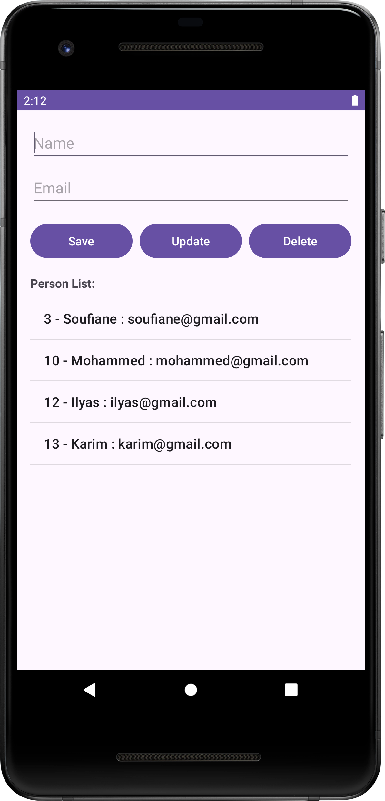

# SQLite Room CRUD Application

A simple Android application demonstrating basic CRUD (Create, Read, Update, Delete) operations using Room (an abstraction over SQLite).

## Features

- Add new users to the local Room database
- View all users in a ListView
- Update existing user information
- Delete users from the database
- Clear input fields after operations
- Input validation with Toast messages

## Project Structure

The application consists of the following components:

1. **MainActivity**: Handles the UI and user interaction logic.
2. **Person.java**: Room entity class representing the User model.
3. **PersonDao.java**: Data Access Object interface for defining SQLite operations.
4. **AppDatabase.java**: Abstract class that initializes the Room database.

## Implementation Details

### Database Structure

The app uses Room to create and manage an SQLite database with a single table:

- **Table Name**: `Person`
- **Columns**:
    - `id` (INTEGER): Primary key, auto-generated
    - `name` (TEXT): Person’s name
    - `email` (TEXT): Person’s email address

### CRUD Operations

- **Create**: Add a new person with name and email
- **Read**: Display all persons in a ListView in the format `id - name : email`
- **Update**: Modify selected person’s details
- **Delete**: Remove selected person from the database

## How to Use

1. **Add Person**:
    - Fill in both "Name" and "Email" fields
    - Click the **Save** button

2. **View Persons**:
    - All records are shown in a ListView below the input fields

3. **Update Person**:
    - Select a person from the list
    - Their details will auto-fill into the text fields
    - Edit them and click the **Update** button

4. **Delete Person**:
    - Select a person from the list
    - Click the **Delete** button

## Technical Stack

- **Room Database**: For local persistence using SQLite
- **Live ListView**: Displays all user records
- **Toast Messages**: For user feedback and validation
- **ArrayAdapter**: Populates the ListView from Room data

## Requirements

- Android Studio
- Minimum SDK: API 21 (Android 5.0 Lollipop)
- Target SDK: API 33 (Android 13)
- No internet connection required

## Installation

1. Clone this repository
2. Open the project using Android Studio
3. Build and run it on an emulator or Android device

## Future Enhancements

- Add more fields (e.g. phone number, address)
- Add Material Design components
- Improve form validation (e.g. email format check)